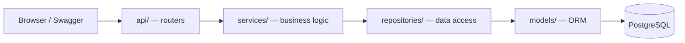
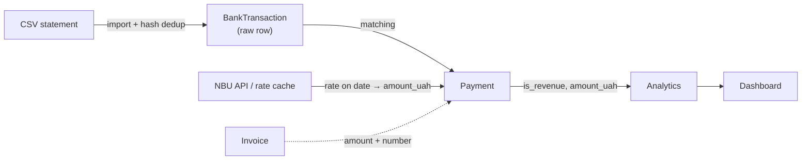

[Українська](README.md) · **English**

# FOPilot

[](https://github.com/hatehisoka/fopilot/actions/workflows/ci.yml)

[](LICENSE)

FOPilot is bookkeeping and financial analytics for a Ukrainian sole proprietor (ФОП) working as a
software developer. It brings hours, invoices and bank inflows into one picture: it imports a bank
statement from CSV, matches payments to invoices, converts foreign currency to hryvnia at the
National Bank (NBU) rate, and shows whether yearly income is approaching the single-tax limit — the
main risk for a group-3 sole proprietor.

> The UI and the in-repo documentation are in Ukrainian by design (this is a Ukrainian tax-domain
> tool); this file is the English overview.


## Features

- Clients, projects, tracked hours and invoices; invoices can be built from billable hours.
- Bank statement CSV import: automatic encoding detection (UTF-8 / Windows-1251), per-bank YAML
  column-mapping profiles, varied date and decimal formats, deduplication, and a result report.
- Automatic matching of inflows to invoices by amount, date and the invoice number in the payment
  description; ambiguous matches go to manual review.
- Foreign-currency payments converted to hryvnia at the NBU rate, with DB caching and a
  business-day fallback.
- Analytics: receipts by period, utilization, revenue concentration by client, and a forecast of
  reaching the annual single-tax limit.
- Dashboard: four charts plus a recent-inflows table.

## Stack

| Layer | Technologies |
|-------|-------------|
| Backend | Python 3.12, FastAPI, Pydantic v2 |
| Database | PostgreSQL 16, SQLAlchemy 2, Alembic |
| Analytics | pandas + SQL |
| Frontend | React, TypeScript, Vite, Recharts |
| Tests / quality | pytest, ruff |
| Infrastructure | Docker Compose, GitHub Actions |

## Quick start

```bash
cp .env.example .env
docker compose up --build
```

Brings up three services: PostgreSQL, backend and frontend. Then:

- Dashboard: <http://localhost:5173>
- API + Swagger: <http://localhost:8000/docs>

Demo data (clients, projects, hours, invoices, payments and sample statements):

```bash
docker compose exec backend python scripts/seed.py
```

The seed is deterministic and builds a scenario of a sole proprietor nearing the single-tax limit,
so every dashboard metric is populated immediately. NBU rates come from an offline snapshot — the
demo works without internet.

<details>
<summary>Local backend development (without Docker)</summary>

```bash
cd backend
pip install -e ".[dev]"
alembic upgrade head
python scripts/seed.py           # --force to overwrite existing data
uvicorn app.main:app --reload

ruff check . && ruff format --check .
pytest
```

Requires PostgreSQL 16 (see `.env`). The container DB is published on host port `5433` to avoid
clashing with a local Postgres on `5432`.
</details>

## Architecture

The backend is layered: thin routers, business logic in services, data access in repositories, ORM
models kept separate from Pydantic schemas.



The point is that this is not CRUD — the value is the pipeline from a raw statement to analytics.



A few decisions worth highlighting (full log in
[`docs/architecture-decisions.md`](docs/architecture-decisions.md), Ukrainian):

- **CSV import is resilient to real statements.** Encoding is auto-detected; column mapping is
  configured via YAML profiles. Deduplication is deterministic: the row hash includes the row's
  occurrence index within the file, so re-importing the same file is filtered out while two genuine
  identical payments on the same day both go through (ADR-008).
- **NBU rate with fallback and provenance.** The NBU publishes no rate on weekends/holidays, so
  conversion uses the last business day before the payment date (bounded), and the rate's origin is
  recorded in a separate field. Rates are cached — the API is never queried twice for the same date
  (ADR-006).
- **Payment matching is deliberately narrow and idempotent.** Only an exact amount confirmed by the
  invoice number is auto-matched; partial and split payments go to manual review rather than being
  guessed. A partial unique index guarantees one payment per bank row, so re-running matching
  produces no duplicates (ADR-013).
- **Cash-method analytics.** Income is counted from actual hryvnia inflows, and the single-tax
  forecast uses a within-calendar-year run-rate with a guard against extrapolating from too little
  history. Not every inflow is revenue — own-card top-ups are excluded via `is_revenue`
  (ADR-007, ADR-012, ADR-015).

## Tests

```bash
cd backend && pytest
```

Tests target the hard logic, not getters: the CSV parser (encodings, formats, dedup), payment
matching (all branches, idempotency, rate-error isolation), analytics (edge cases — empty DB,
division by zero, already-exceeded limit) and DB invariants (double billing, uniqueness).
Integration tests run against a real PostgreSQL.

If the DB is unreachable, tests skip locally for convenience — but with `FOPILOT_REQUIRE_DB=1` (set
in CI) a skip becomes a failure, so the pipeline cannot go green on untested code.

## Limitations and out of scope

Deliberately excluded (rationale in the decision log):

- **Partial, split and overpayments are not automated** — they go to manual review. Automating them
  means high-risk false-match heuristics (ADR-013).
- **Holidays are not accounted for** in the working-day calendar for utilization — only weekends. A
  documented simplification with a predictable error (ADR-016).
- **No authentication or multi-tenancy** — the app targets a single sole proprietor.
- **CSV statement import instead of a bank API.** A personal bank token is access to a real account;
  the security risk outweighs the convenience for a learning project.
- **Compose runs the frontend in Vite dev mode**, not a production build behind nginx. A deliberate
  choice for a development/demo environment; a production setup (static build, reverse proxy) is out
  of scope.

## License

[MIT](LICENSE).

---

Built as part of a practical internship at Taras Shevchenko National University of Kyiv, 2026.
