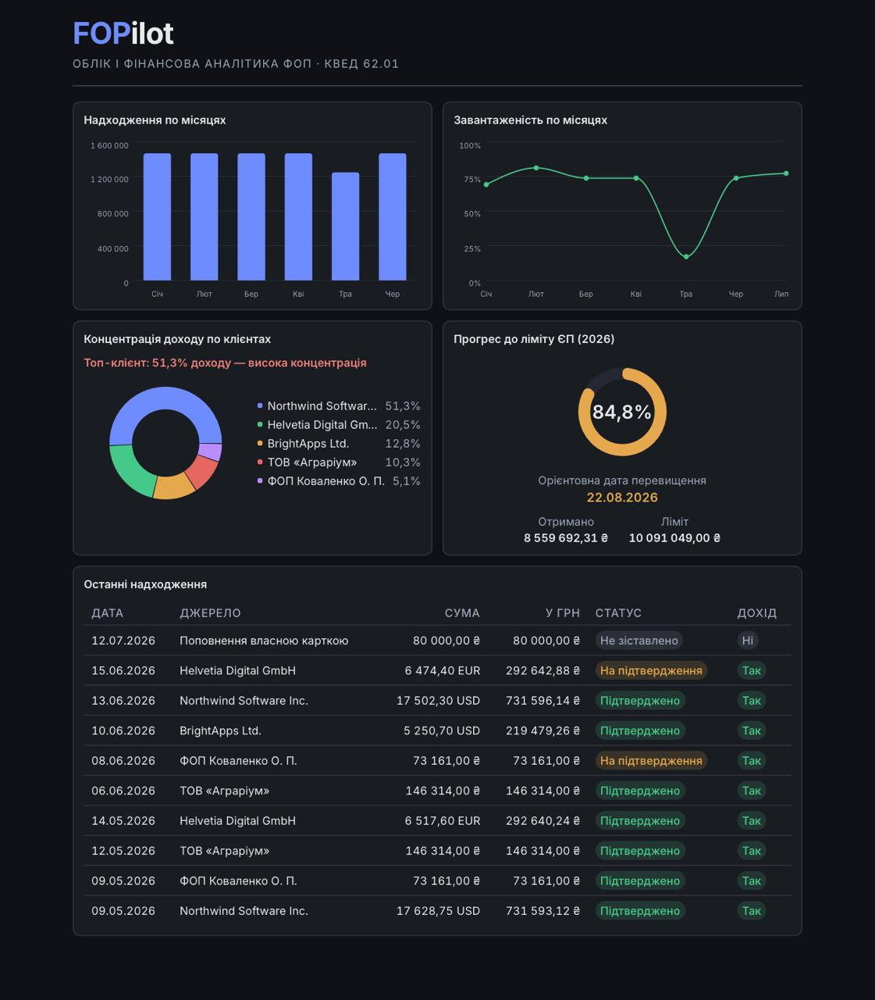
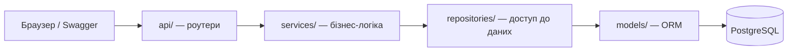
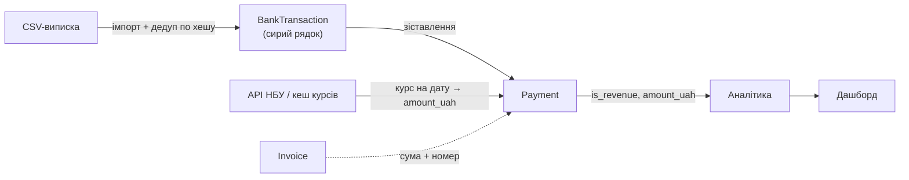

**Українська** · [English](README.en.md)

# FOPilot

[](https://github.com/hatehisoka/fopilot/actions/workflows/ci.yml)

[](LICENSE)

FOPilot — облік і фінансова аналітика для ФОП-розробника (КВЕД 62.01). Він зводить години,
інвойси й банківські надходження в одну картину: імпортує виписку з CSV, зіставляє платежі з
інвойсами, перераховує валюту в гривню за курсом НБУ і показує, чи наближається річний дохід до
ліміту єдиного податку — головного ризику ФОПа-третьогрупника.



## Можливості

- Облік клієнтів, проєктів, годин (треклог) та інвойсів; генерація інвойсів із оплачуваних годин.
- Імпорт банківської виписки з CSV: автовизначення кодування (UTF-8 / Windows-1251), YAML-профілі
  під різні банки, різні формати дат і десяткових роздільників, дедуплікація, звіт про результат.
- Автоматичне зіставлення надходжень з інвойсами за сумою, датою й номером у призначенні платежу;
  спірні збіги — на ручне підтвердження.
- Перерахунок валютних платежів у гривню за курсом НБУ з кешуванням і фолбеком на робочий день.
- Аналітика: надходження по періодах, завантаженість, концентрація доходу по
  клієнтах, прогноз досягнення річного ліміту єдиного податку.
- Дашборд: 4 графіки + таблиця останніх надходжень.

## Стек

| Шар | Технології |
|-----|-----------|
| Бекенд | Python 3.12, FastAPI, Pydantic v2 |
| База даних | PostgreSQL 16, SQLAlchemy 2, Alembic |
| Аналітика | pandas + SQL |
| Фронтенд | React, TypeScript, Vite, Recharts |
| Тести / якість | pytest, ruff |
| Інфраструктура | Docker Compose, GitHub Actions |

## Швидкий старт

```bash
cp .env.example .env
docker compose up --build
```

Піднімає три сервіси: PostgreSQL, бекенд і фронтенд. Після старту:

- Дашборд: <http://localhost:5173>
- API + Swagger: <http://localhost:8000/docs>

Демо-дані (клієнти, проєкти, години, інвойси, платежі й приклади банківських виписок):

```bash
docker compose exec backend python scripts/seed.py
```

Seed детермінований і будує сценарій ФОПа, що наблизився до ліміту ЄП, тож дашборд одразу
показує всі метрики. Курси НБУ беруться з офлайн-снапшота — демо працює без інтернету.

<details>
<summary>Локальна розробка бекенду (без Docker)</summary>

```bash
cd backend
pip install -e ".[dev]"
alembic upgrade head
python scripts/seed.py           # --force щоб перезаписати наявні дані
uvicorn app.main:app --reload

ruff check . && ruff format --check .
pytest
```

Потрібен PostgreSQL 16 (див. `.env`). Контейнерна БД публікується на хост-порт `5433`, щоб не
конфліктувати з локально встановленим Postgres на `5432`.
</details>

## Архітектура

Бекенд шаруватий: роутери тонкі, бізнес-логіка живе в сервісах, доступ до даних — у репозиторіях,
ORM-моделі відокремлені від Pydantic-схем.



Ключове — це не CRUD: значення дає конвеєр від сирої виписки до аналітики.



Кілька рішень, які варто підсвітити (повний журнал — у
[`docs/architecture-decisions.md`](docs/architecture-decisions.md)):

- **Імпорт CSV стійкий до реальних виписок.** Кодування визначається автоматично, мапування
  колонок — конфігуроване через YAML-профілі. Дедуплікація детермінована: хеш рядка включає
  порядковий номер його входження у файлі, тож повторний імпорт того самого файлу відсіюється, а
  два легітимні однакові платежі в один день — проходять як окремі (ADR-008).
- **Курс НБУ з фолбеком і провенансом.** На вихідні/свята НБУ курсу не публікує, тож перерахунок
  бере останній робочий день до дати платежу (з обмеженням глибини), а походження курсу
  фіксується окремим полем. Курси кешуються в БД — API за ту саму дату не смикається двічі
  (ADR-006).
- **Зіставлення платежів — свідомо вузьке й ідемпотентне.** Автоматично матчиться лише точний збіг
  суми, підтверджений номером інвойса; часткові й множинні оплати йдуть на ручне рішення, а не
  вгадуються. Один банківський рядок породжує щонайбільше один платіж — це гарантує частковий
  unique-індекс у БД, тож повторний прогін не плодить дублікатів (ADR-013).
- **Аналітика касовим методом.** Дохід рахується по фактичних надходженнях у гривні, а прогноз
  ліміту ЄП — через run-rate у межах календарного року із запобіжником проти екстраполяції з
  надто короткої історії. Не кожне надходження — дохід (поповнення власною карткою виключається
  прапорцем `is_revenue`) (ADR-007, ADR-012, ADR-015).

## Тести

```bash
cd backend && pytest
```

Тести цілять у складну логіку, а не в геткери: парсер CSV (кодування, формати, дедуплікація),
зіставлення платежів (усі гілки, ідемпотентність, ізоляція помилки курсу), аналітичні розрахунки
(крайові випадки — порожня база, ділення на нуль, вже перевищений ліміт) та інваріанти БД
(подвійний білинг, унікальність). Інтеграційні тести працюють проти справжнього PostgreSQL.

Якщо БД недоступна, тести локально пропускаються задля зручності — але зі змінною
`FOPILOT_REQUIRE_DB=1` (виставлена в CI) пропуск стає помилкою, тож пайплайн не може стати зеленим
на непротестованому коді.

## Обмеження та поза скоупом

Свідомо відкинуте (обґрунтування — у журналі рішень):

- **Часткові, множинні та надлишкові оплати не автоматизуються** — вони йдуть у ручне
  підтвердження. Автоматика таких випадків — це евристики з високим ризиком хибних збігів
  (ADR-013).
- **Свята не враховуються** в календарі робочих днів для завантаженості — лише вихідні. Це
  задокументоване спрощення; похибка передбачувана (ADR-016).
- **Немає автентифікації та багатокористувацькості** — застосунок розрахований на одного ФОПа.
- **Імпорт виписки з CSV, а не інтеграція з банківським API.** Персональний токен банку — це
  доступ до реального рахунку; ризик безпеки переважує зручність для навчального проєкту.

## Ліцензія

[MIT](LICENSE).

---

Проєкт виконано в межах навчальної практики, КНУ ім. Тараса Шевченка, 2026.
