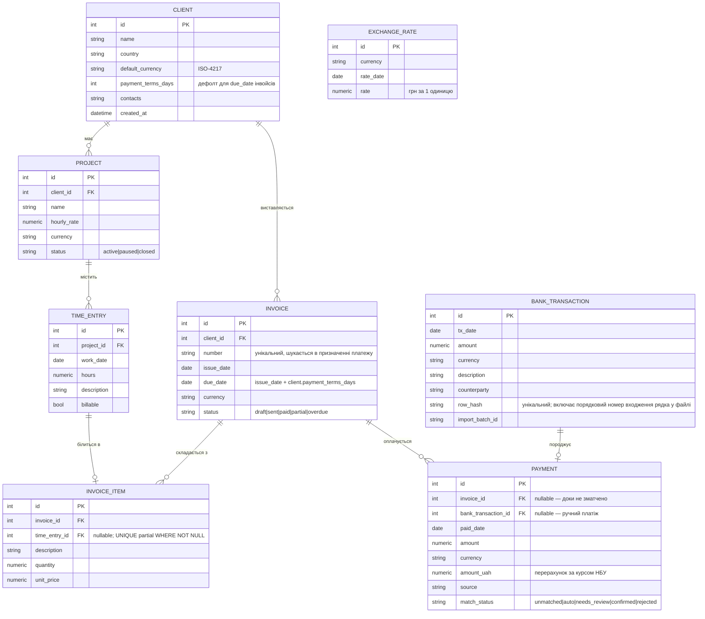

# План проєкту FOPilot

Вебзастосунок обліку та фінансової аналітики для ФОП (КВЕД 62.01, комп'ютерне програмування).
Навчальна практика, один виконавець, строк — один місяць.

> **Історичний документ.** Це початковий план, зафіксований до старту розробки. По ходу роботи
> частина рішень змінилася — план навмисно не переписується заднім числом. Фактичні відхилення з
> обґрунтуванням зібрані в розділі [«Відхилення від початкового плану»](#відхилення-від-початкового-плану)
> наприкінці. Актуальний стан коду описують `docs/architecture-decisions.md` і `README.md`.

## Стек (зафіксований)

| Шар | Технологія |
|-----|-----------|
| Бекенд | Python 3.12 + FastAPI + Pydantic v2 |
| БД | PostgreSQL 16 + SQLAlchemy 2.x + Alembic |
| Аналітика | pandas + SQL |
| Фронтенд | React + TypeScript + Vite + Recharts |
| Тести | pytest |
| Якість коду | ruff (лінт + формат) |
| Інфра | Docker Compose + GitHub Actions |

## 1. ER-модель



### Ключові рішення моделі

- **`BANK_TRANSACTION` і `PAYMENT` — окремі сутності.** `BankTransaction` — сирий незмінний
  рядок виписки (джерело правди для дедуплікації через `row_hash`). `Payment` — бізнес-факт
  надходження, який матчиться до інвойса. Один імпортований рядок породжує щонайбільше один
  `Payment`; ручні надходження можливі без транзакції.
- **Матчинг без окремої таблиці-суджень.** Спірні збіги: `match_status = needs_review` +
  `invoice_id` як пропозиція. Користувач підтверджує (`confirmed`) або відхиляє (`rejected`).
- **`amount_uah` зберігається на `Payment`** — щоб аналітика в гривні була детермінованою й не
  залежала від доступності API НБУ на момент запиту.
- **`ExchangeRate` — кеш-таблиця**, унікальність по `(currency, rate_date)`. API НБУ смикаємо
  лише коли курсу на дату немає.
- **`INVOICE_ITEM` окремою таблицею (не JSON):** позиції треба агрегувати й фільтрувати в
  аналітиці, тож нормалізована схема виправдана.
- **`TIME_ENTRY 1—o| INVOICE_ITEM` (nullable):** інвойс можна згенерувати з треклогу
  (`billable` години → позиції: `quantity` = години, `unit_price` = ставка проєкту). Ручні
  позиції лишаються можливими (`time_entry_id` = NULL).
- **Захист від подвійного білингу — на рівні БД.** Часткового унікального індексу
  `UNIQUE (time_entry_id) WHERE time_entry_id IS NOT NULL` на `invoice_item`. Зв'язок `0..1`
  сам по собі нічого не гарантує — інваріант має бути в схемі, а не в умовності сервісу.
- **`Invoice.amount` — SQLAlchemy `column_property`, а не Python-`@property`.** Сума інвойса =
  `SUM(quantity × unit_price)` по позиціях, реалізована як `column_property` з корельованим
  підзапитом по `InvoiceItem`. Саме `column_property`, бо суму треба вживати в SQL (матчинг,
  аналітика виручки) — фільтрувати, сортувати, агрегувати; чистий `@property` цього не вміє.
  Одна правда (позиції), менше станів. → фіксується в `architecture-decisions.md`.
- **Ліміт ЄП рахується касовим методом.** Прогноз досягнення річного ліміту єдиного податку
  будується на фактично отриманих коштах — `SUM(Payment.amount_uah)`, а не на виставлених
  інвойсах. Виставлений, але неоплачений інвойс у ліміт не входить (це відповідає правилам ЄП).
  → окремим пунктом у `architecture-decisions.md`; критично для коміту №8.
- **`due_date` і `payment_terms_days`.** Без `due_date` статус `overdue` немає від чого рахувати.
  `due_date` = `issue_date + client.payment_terms_days` (підставляється автоматично, редагується
  вручну). `payment_terms_days` на клієнті — дефолт умов оплати.
- **Курс НБУ на вихідні/свята.** Курсу на неробочі дні немає. Перерахунок валютних платежів
  використовує явний фолбек: якщо на дату платежу курсу немає — беремо останній робочий день до
  неї, з обмеженням глибини пошуку (7 днів). Якщо в межах 7 днів курсу немає — помилка, а не
  тихий 0. Окремий тест на цей сценарій (платіж у суботу).

## 2. Структура репозиторію

```
fopilot/
├── README.md                      # укр.
├── CLAUDE.md                      # правила проєкту
├── docker-compose.yml
├── .env.example
├── .gitignore
├── .github/workflows/ci.yml       # ruff + pytest
├── docs/
│   ├── plan.md                    # цей файл
│   └── architecture-decisions.md  # укр., ведеться паралельно з кодом
├── backend/
│   ├── pyproject.toml             # deps + ruff config
│   ├── alembic.ini
│   ├── Dockerfile
│   ├── app/
│   │   ├── main.py                # FastAPI app
│   │   ├── config.py              # pydantic-settings
│   │   ├── db.py                  # engine, session
│   │   ├── api/                   # тонкі роутери
│   │   │   ├── clients.py projects.py time_entries.py
│   │   │   ├── invoices.py imports.py payments.py analytics.py
│   │   ├── services/              # csv_import, matching, nbu, analytics, invoicing
│   │   ├── repositories/          # доступ до даних
│   │   ├── models/                # ORM SQLAlchemy
│   │   ├── schemas/               # Pydantic v2
│   │   └── import_profiles/       # YAML-профілі мапування колонок банків
│   ├── migrations/                # Alembic
│   ├── scripts/seed.py
│   └── tests/
│       ├── test_csv_import.py test_matching.py test_analytics.py
│       └── fixtures/              # приклади CSV (різні кодування/формати)
└── frontend/
    ├── package.json vite.config.ts Dockerfile index.html
    └── src/
        ├── main.tsx App.tsx api.ts types.ts format.ts   # format.ts — локалізація
        └── components/            # 4 графіки Recharts + таблиця
```

## 3. План комітів

| # | Коміт | Зміст |
|---|-------|-------|
| 1 | `chore: scaffold repo, docker-compose, tooling` | Структура, `docker-compose`, `.env.example`, ruff, `CLAUDE.md`, каркас `docs/`, CI-заглушка |
| 2 | `feat(db): ORM models and initial migration` | Усі моделі (з `time_entry_id` у `InvoiceItem`) + перша Alembic-міграція |
| 3 | `feat(api): CRUD for clients, projects, time entries, invoices` | Схеми Pydantic, репозиторії, тонкі роутери |
| 4 | `feat(invoicing): build invoices from billable time entries` | Генерація позицій із треклогу + захист від подвійного білингу. Тести |
| 5 | `feat(nbu): NBU exchange rate client with DB caching` | `services/nbu.py`, кеш у `ExchangeRate`, тести |
| 6 | `feat(import): CSV bank statement import` | **Ядро.** Автовизначення кодування, YAML-профілі, дати/розділювачі, дедуп по хешу, звіт. Тести з фікстурами |
| 7 | `feat(matching): auto-match payments to invoices` | Матчинг сума/дата/номер, `needs_review`, ендпоінт підтвердження. Тести |
| 8 | `feat(analytics): revenue, utilization, concentration, EP-limit forecast` | pandas+SQL, run-rate, ліміт із конфігу. Тести |
| 9 | `feat(scripts): synthetic seed data` | `seed.py`: сценарій наближення до ліміту ЄП |
| 10 | `feat(frontend): dashboard with 4 charts and transactions table` | React+Vite+Recharts, локалізація |
| 11 | `ci: ruff and pytest on push` | Наповнення `ci.yml` |
| 12 | `docs: finalize README and architecture decisions` | Фінальний прохід документації |

### Принципи процесу

- `docs/architecture-decisions.md` дописується **на кожному етапі**, а не в кінці.
- Тести йдуть у тих самих комітах, що й логіка (4, 5, 6, 7, 8).
- Порядок: фундамент (БД → CRUD → інвойси з треклогу) → незалежний блок НБУ → ядро
  (імпорт → матчинг) → аналітика поверх усього → seed → фронт поверх готового API.

### Локалізація

- **UI повністю україномовний:** підписи, заголовки, легенди графіків, повідомлення про
  помилки, формат дат (`dd.MM.yyyy`), формат чисел (пробіл — роздільник тисяч, кома —
  десятковий). Централізовано у `frontend/src/format.ts`.
- **Англійською лишається тільки код:** назви змінних, компонентів, ключі в API-відповідях,
  коміти, докстрінги.
- **Українською:** README, документація, коментарі до складної логіки.

## Відхилення від початкового плану

План був живим інструментом: нижче — свідомі відхилення від нього з обґрунтуванням.

- **CI поїхав із №11 у №3.** Інтеграційні тести CRUD одразу потребували Postgres-сервісу й
  `FOPILOT_REQUIRE_DB`. Тримати їх «пропущеними» в пайплайні до №11 означало б імітацію
  тестування — зелений CI на непротестованому коді. Тож сервіс і змінну додано разом із першими
  DB-тестами; у №11 лишилося додати окремий джоб для фронту.
- **Додано `ExchangeRate.source_date`** (провенанс курсу), вкладено в міграцію коміту імпорту
  (№6). Кешування курсу під календарною датою платежу втрачало походження — рядок «субота, курс X»
  не відрізнявся від опублікованого НБУ. Nullable-поле робить фолбек видимим (ADR-006).
- **Додано `Payment.is_revenue` + частковий unique-індекс на `bank_transaction_id`** у комміті
  матчингу (№7). Не кожне надходження — дохід (поповнення власною карткою завищувало б ліміт ЄП;
  ADR-012), а ідемпотентність матчингу має триматися на інваріанті БД, а не на акуратності коду
  (ADR-013).
- **Скоуп матчингу звужено свідомо** — автоматично лише точний збіг суми, решта в `needs_review`;
  обробка політранзакційна (помилка курсу на одному платежі не валить прогін). Зафіксовано
  окремим рішенням (ADR-013).
- **Аналітику конкретизовано під час реалізації №8:** касовий метод і підпис «Надходження»
  (ADR-014), календарний рік і запобіжник run-rate (ADR-015), ємність як знаменник завантаженості
  (ADR-016), видимий лічильник несконвертованих платежів (ADR-017). Це уточнення, що
  запобігають тихим неправильним числам.
- **Два дизайн-проходи фронту понад план** (світлий → системний з токенами, далі темна тема) плюс
  правка брендового хедера — після базового дашборда з №10, окремими `style(...)`-комітами.
- **Інфраструктурне уточнення:** контейнерний Postgres публікується на хост-порт `5433`, щоб не
  конфліктувати з локально встановленим Postgres на `5432` (ADR-009).

Разом журнал рішень розрісся до ADR-001…019 — по одному запису на кожне нетривіальне рішення,
ухвалене по ходу.
